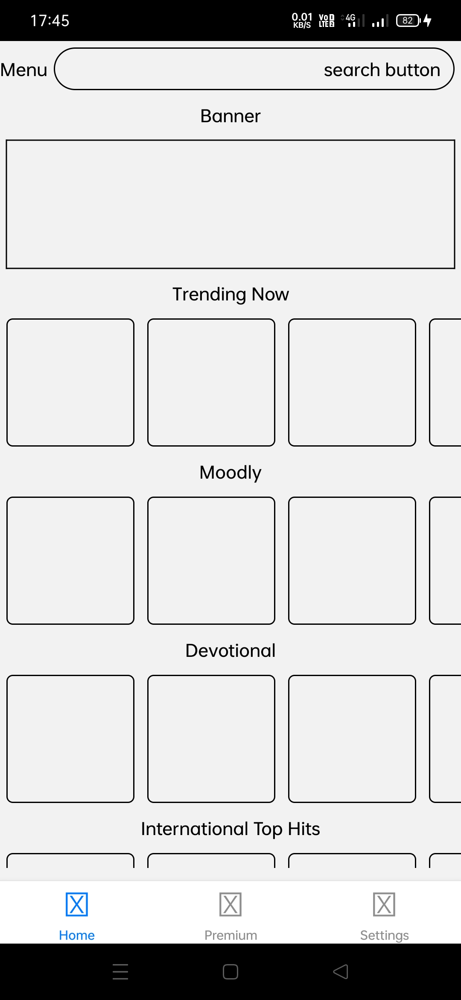
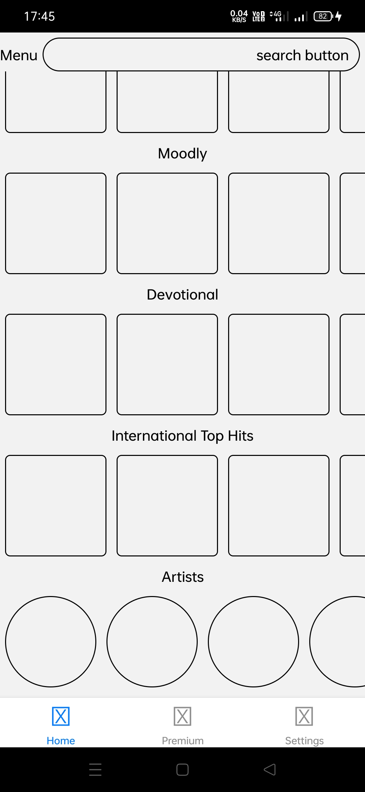

# Simple_Layout_of_Music_Application

**This is a Simple Layout of a music application with bottomTab and Stack Navigation created using React-Native**

*Beginners are mostly WELCOME*

*Steps to start the project:*

1. clone the repo 
2. go the project directory
3. run 'npm install' 
4. run 'npx react-native run-android' for android
5. run 'npx react-native run-ios' for ios
6. Or you can follow the official docs of react native - https://reactnative.dev/docs/environment-setup

# DEVELOPMENT MAKES LIFE EASIER

# ScreenShots

<pre>                      <pre>
